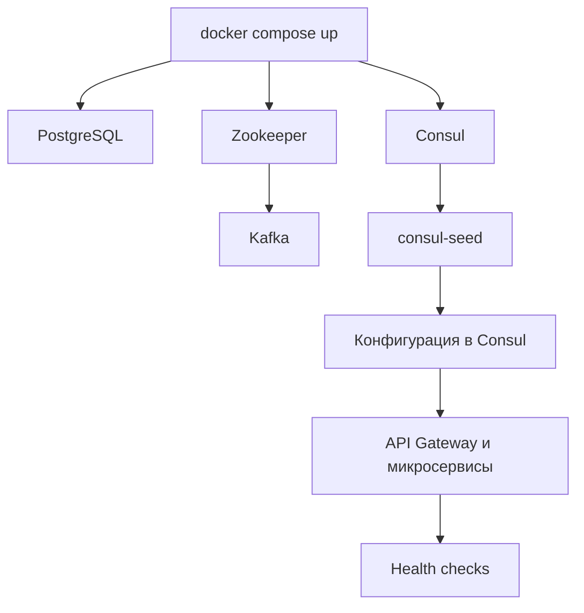
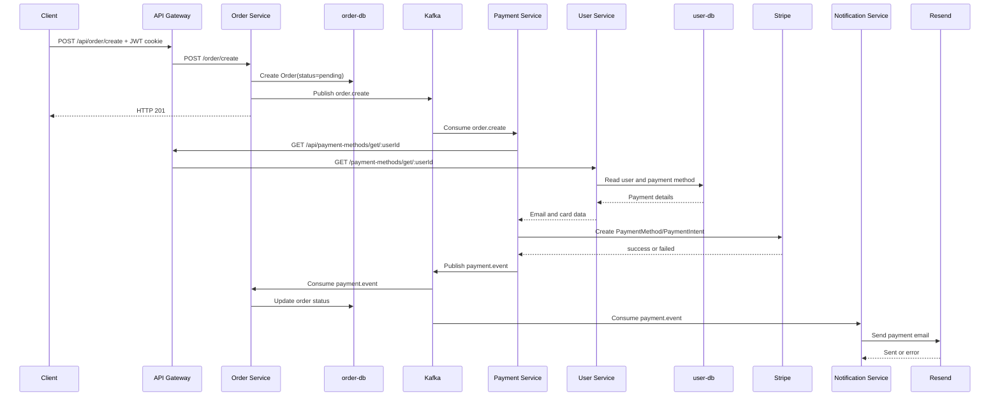

# Сценарии работы системы

Документ описывает три основных пользовательских кейса:

1. старт системы;
2. авторизация пользователя;
3. создание заказа и прохождение события через микросервисы.

## Архитектура и адреса

Внешние адреса локального стенда:

| Компонент | Адрес |
| --- | --- |
| API Gateway | `http://localhost:3000` |
| User Service | `http://localhost:1000` |
| Order Service | `http://localhost:2001` |
| Payment Service | `http://localhost:4000` |
| Notification Service | `http://localhost:5000` |
| Config Service | `http://localhost:6000` |
| Consul UI/API | `http://localhost:8500` |
| Kafka | `localhost:9092` |
| User PostgreSQL | `localhost:5432` |
| Order PostgreSQL | `localhost:5433` |

Order Service слушает порт `2000` внутри контейнера, но опубликован наружу как `2001`, поскольку порт `2000` занят в локальном окружении.

Внутри текущего Compose-окружения сервисы Kafka используют `KAFKA_BROKERS=host.docker.internal:9092`. Это связано с особенностями bridge-сети Docker в окружении разработки.

---

## Кейс 1. Старт системы

### 1. Запуск Compose

Из корня проекта выполняется:

```bash
docker compose up -d --build
```

Docker Compose собирает образы TypeScript-сервисов и запускает инфраструктуру:

- `zookeeper` — координация Kafka;
- `kafka` — брокер сообщений;
- `user-db` — PostgreSQL для пользователей и платёжных методов;
- `order-db` — PostgreSQL для заказов;
- `consul` — KV-хранилище конфигурации;
- `consul-seed` — однократно загружает `services.yaml` в Consul.

Затем запускаются приложения:

- `api-gateway`;
- `user-service`;
- `order-service`;
- `payment-service`;
- `notification-service`;
- `config-service`.

### 2. Загрузка конфигурации

1. `consul` стартует в dev-режиме.
2. `consul-seed` ждёт доступности Consul.
3. `consul-seed` читает `services/config-service/config/services.yaml`.
4. Конфигурация каждого сервиса записывается в Consul по ключам `config/<service-name>`.
5. Приложения получают порт и URL зависимостей через свои config-модули.
6. Если Consul временно недоступен, сервисы используют значения из переменных окружения и fallback-конфигурацию.

### 3. Подготовка баз данных

После первого запуска необходимо применить Prisma migrations:

```bash
docker compose exec user-service npx prisma migrate deploy
docker compose exec order-service npx prisma migrate deploy
```

В результате создаются:

- таблица `User` и таблица `Payment_methods` в `user-db`;
- таблица `Order` в `order-db`.

Без этого User Service и Order Service запустятся, но запросы к Prisma завершатся ошибкой о недостающих таблицах.

### 4. Проверка доступности

```bash
curl http://localhost:3000/
curl http://localhost:1000/
curl http://localhost:2001/
curl http://localhost:4000/
curl http://localhost:5000/
curl http://localhost:6000/
```

Ожидаемый результат для каждого endpoint: HTTP `200` и сообщение о работающем сервисе.

### Поток старта



---

## Кейс 2. Авторизация пользователя

Авторизация проходит через API Gateway и User Service.

### 1. Регистрация

Клиент отправляет запрос:

```http
POST http://localhost:3000/api/auth/signup
Content-Type: application/json
```

Пример тела:

```json
{
  "name": "Test User",
  "email": "user@example.com",
  "password": "Test1234!",
  "phone_number": "+919876543210"
}
```

Последовательность обработки:

1. `api-gateway` получает `/api/auth/signup`.
2. Gateway применяет rate limiter для auth-маршрутов.
3. Gateway убирает префикс `/api` и проксирует запрос как `/auth/signup` в `user-service`.
4. `user-service` валидирует тело через Zod.
5. User Service проверяет уникальность email в `user-db`.
6. Пароль хешируется через `bcrypt`.
7. Пользователь сохраняется в PostgreSQL через Prisma.
8. Клиент получает HTTP `201` с `id` и `email`.

### 2. Вход

Клиент отправляет:

```http
POST http://localhost:3000/api/auth/signin
Content-Type: application/json
```

```json
{
  "email": "user@example.com",
  "password": "Test1234!"
}
```

Последовательность обработки:

1. Gateway снова проксирует запрос в User Service.
2. User Service находит пользователя в `user-db`.
3. `bcrypt` сравнивает пароль с хешем.
4. User Service подписывает JWT через `JWT_SECRET_KEY`.
5. JWT возвращается в JSON и записывается в cookie `token`.
6. Cookie имеет параметры `httpOnly`, `secure` и `sameSite=none`.
7. Клиент использует cookie в последующих защищённых запросах.

### 3. Проверка авторизации

Защищённые маршруты User Service и Order Service используют `authMiddleware`:

1. middleware читает cookie `token`;
2. проверяет JWT через `JWT_SECRET_KEY`;
3. извлекает `userId` из payload;
4. записывает его в `req.user.id`;
5. передаёт запрос контроллеру.

Если cookie отсутствует или JWT недействителен, сервис возвращает HTTP `401`.

### 4. Добавление платёжного метода

Это подготовительный шаг перед созданием заказа:

```http
POST http://localhost:3000/api/payment-methods/add
Content-Type: application/json
Cookie: token=<jwt>
```

```json
{
  "card_number": "4242424242424242",
  "expiry_date": "12/34",
  "cardholder_name": "Test User"
}
```

Путь запроса:

```text
Client -> API Gateway -> User Service -> user-db
```

User Service:

- проверяет JWT;
- валидирует номер карты и срок действия;
- преобразует `MM/YY` в дату;
- сохраняет платёжный метод в `Payment_methods`.

---

## Кейс 3. Создание заказа

### 1. Создание заказа через Gateway

Клиент отправляет:

```http
POST http://localhost:3000/api/order/create
Content-Type: application/json
Cookie: token=<jwt>
```

```json
{
  "item": "Kafka test order",
  "amount": 100
}
```

### 2. API Gateway

1. Gateway принимает `/api/order/create`.
2. Применяет order rate limiter.
3. Убирает `/api` из пути.
4. Проксирует запрос в Order Service как `/order/create`.
5. Cookie и тело запроса передаются дальше.

### 3. Order Service: проверка и сохранение

1. `authMiddleware` проверяет JWT и получает `userId`.
2. `OrderSchema` проверяет `item` и `amount`.
3. Order Service создаёт заказ в `order-db` со статусом `pending`.
4. Prisma генерирует `orderId`.
5. Сервис формирует событие:

```json
{
  "orderId": "<uuid>",
  "userId": "<uuid>",
  "amount": 100,
  "item": "Kafka test order"
}
```

6. Событие публикуется в Kafka topic `order.create`.
7. Клиент сразу получает HTTP `201`:

```json
{
  "success": true,
  "message": "Order created successfully"
}
```

HTTP `201` означает, что заказ сохранён и событие принято к дальнейшей обработке. Финальный статус нужно получать отдельным запросом.

### 4. Payment Service

Payment Service подписан на topic `order.create` с consumer group `payment-service-group`.

1. Payment Service получает событие заказа.
2. Извлекает `orderId`, `userId`, `amount` и `item`.
3. Через API Gateway запрашивает платёжные данные пользователя:

```http
GET http://localhost:3000/api/payment-methods/get/<userId>
```

Фактический маршрут прохождения:

```text
Payment Service -> API Gateway -> User Service -> user-db
```

4. User Service возвращает email и платёжный метод.
5. Payment Service нормализует дату карты из ISO-формата Prisma в `MM/YY`.
6. Payment Service передаёт данные в Stripe utility.
7. Stripe utility создаёт PaymentMethod и PaymentIntent.
8. Результат получает статус `success` или `failed`.
9. Payment Service публикует событие в Kafka topic `payment.event`.

Пример события:

```json
{
  "orderId": "<uuid>",
  "userId": "<uuid>",
  "email": "user@example.com",
  "amount": 100,
  "item": "Kafka test order",
  "paymentStatus": "success",
  "paymentIntentId": "<stripe-id>"
}
```

При недоступном или тестовом Stripe ключе платёж может завершиться `failed`, но событие `payment.event` всё равно должно быть опубликовано.

### 5. Order Service: финальный статус

Order Service одновременно подписан на `payment.event` с consumer group `order-service-group`.

1. Order Service получает результат платежа.
2. Проверяет `paymentStatus`.
3. Обновляет соответствующий заказ в `order-db`:
   - `pending -> success`;
   - `pending -> failed`.
4. Статус можно получить запросом:

```http
GET http://localhost:3000/api/order/status/<orderId>
Cookie: token=<jwt>
```

Ответ:

```json
{
  "success": true,
  "data": {
    "orderId": "<uuid>",
    "status": "success"
  },
  "message": "Order status retrieved successfully."
}
```

### 6. Notification Service

Notification Service также подписан на `payment.event` с consumer group `notification-service-group`.

1. Сервис получает email, order ID, сумму и `paymentStatus`.
2. Для `success` отправляет письмо об успешной оплате через Resend.
3. Для `failed` отправляет письмо о неуспешной оплате.
4. Если отправка письма завершается ошибкой, событие передаётся в DLQ через `sendToDLQ`.

Уведомление не влияет на обновление статуса заказа: статус обновляет Order Service независимо от результата отправки email.

### Полный поток заказа



### Возможные финальные состояния

| Статус | Значение |
| --- | --- |
| `pending` | Заказ создан, но результат платежа ещё не обработан consumer’ом. |
| `success` | Payment Service успешно завершил платёж и Order Service обновил заказ. |
| `failed` | Платёж завершился ошибкой, после чего Order Service установил `failed`. |

---

## Полезная проверка после создания заказа

```bash
curl -sS \
  -H "Cookie: token=<jwt>" \
  http://localhost:3000/api/order/status/<orderId>
```

Для диагностики event flow:

```bash
docker logs -f payment-service
docker logs -f order-service
docker logs -f notification-service
```

Ожидаемая последовательность логов:

1. Payment Service получил `order.create`.
2. Payment Service сформировал `paymentStatus`.
3. Order Service вывел `Status update`.
4. Notification Service отправил письмо или положил событие в DLQ.
